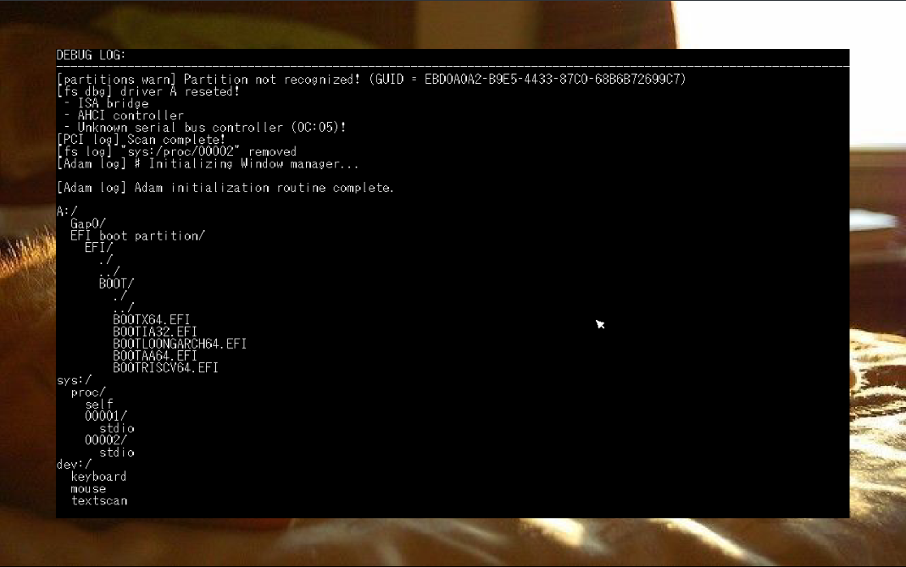

# LUMI OS - LEGACY - V1

> ATTENTION! This is a old legacy version of lumiOS.

x86_64 Kernel and Operating System.

Basically my experiments with OS dev, does not expect
windows 11 2.

## Development Roadmap:

**Project contents:**
- [x] A kernel (obviously lol);
- [x] A application library (WIP);
- [x] A tiny graphics API (WIP)

**Kernel:**
- [x] System Calls;
- [x] Multitheading;
- [x] Pipes (WIP);
- [ ] Executing programs from memory;
- [x] Processes that runs at ring 0;
- [ ] Processes that runs at user space;
- [ ] Linux programs compatibility

**File System:**
- [x] File system tree;
- [x] SATA Devices support (WIP);
- [ ] NVMe Devices support;
- [x] vFAT file system;
- [ ] ext4 system

**Device support:**
- [x] PS/2 Mouse support (WIP);
- [x] PS/2 Keyboard support (WIP);
- [ ] USB General support;
- [ ] USB Mouse support;
- [ ] USB Keyboard support;
- [ ] Basic Graphics Card support;
- [ ] Basic Audio Card support

**Useability:**
- [x] Shell;
- [x] Terminal;
- [x] Graphics (WIP);
- [x] Simple desktop (WIP);
- [x] Mouse Cursor (WIP);
- [x] Wallpapers;
- [ ] File Explorer;
- [ ] Task Manager;
- [ ] Settings Application

obs: don't expect anything above working 100% :3
It works on virtual machines like qemu and in
physical machines too.

## Demos and development history:
Some prints of the OS in execution (QEMU).
From oldest to newest:

